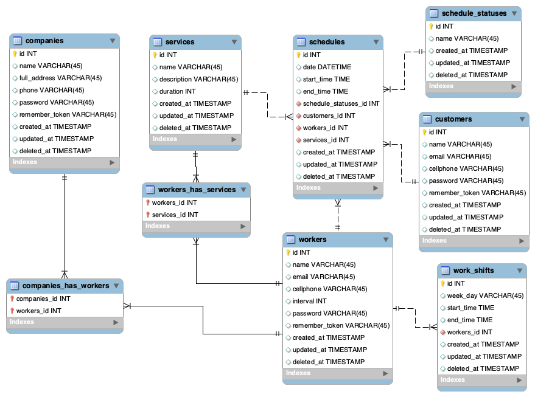

## Ramirogenda
> Projeto com intuito de disseminar os conhecimentos referentes a desenvolvimento com Laravel

### Requisitos
Sistema de agendamentos, pelo qual teremos empresas, cada empresa tem seus profissionais, cada profissional terá seus serviços e o cliente pode agendar um horário com um profissional para realizar um serviço.

___
#### Requisitos funcionais
* Um mesmo serviço pode ser feito por vários profissionais e cada profissional pode realizar vários serviços.
* Cada serviço tem uma duração.
* O profissional pode especificar um tempo de intervalo entre a execução de cada serviço.
* O profissional pode definir quais horários ele trabalha, podendo por exemplo fazer um turno de manhã e outro à noite, ou somente um turno único a tarde, e também turnos diferentes a cada dia da semana.
* Um profissional pode trabalhar em mais de uma empresa.
* Um cliente pode ver os seus agendamentos.
* Cancelamento:
  * Tempo limite para cancelamento

___
#### DER (Diagrama de Entidade Relacionamento)

___
#### TODO
- [ ] Revisar as migrations já criadas e (estudar seguindo a documentação)[https://laravel.com/docs/10.x/migrations]
- [ ] Abrir o model de sua responsabilidade e completar sua implementação

___
#### Responsabilidades
* Company - Marcos
* Worker - Joseph
* Service - Gabriel
* Customer - Patrick
* Schedules Status - Ryan
* Schedules
* Work Shift

___
#### Dúvidas
> Enviem suas dúvidas para o email [veseeutolanaesquina@se.vira](mailto:veseeutolanaesquina@se.vira)
